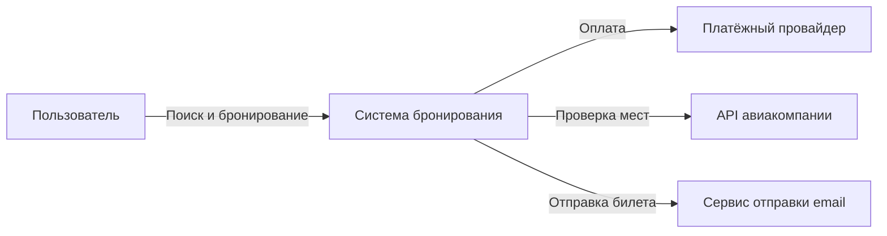
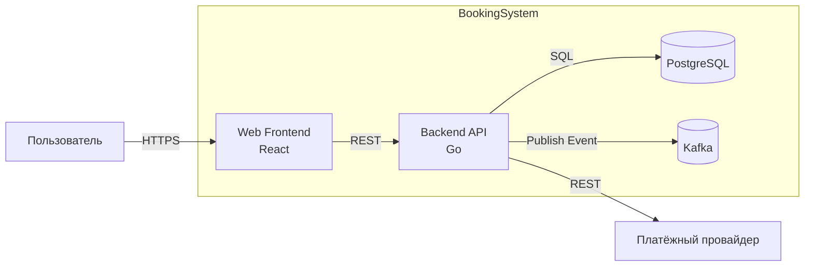
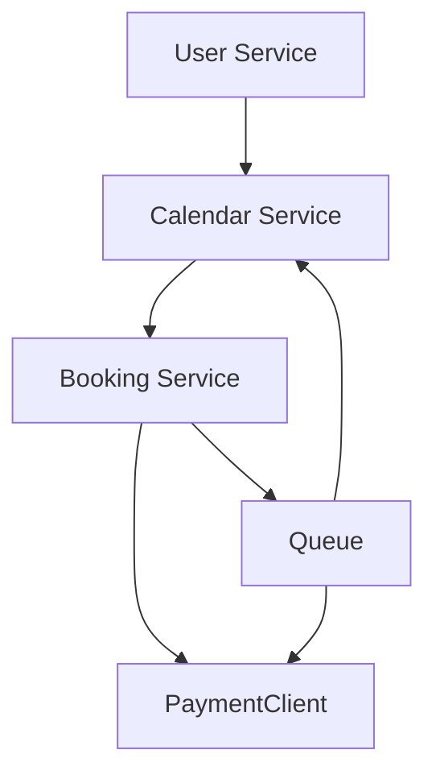
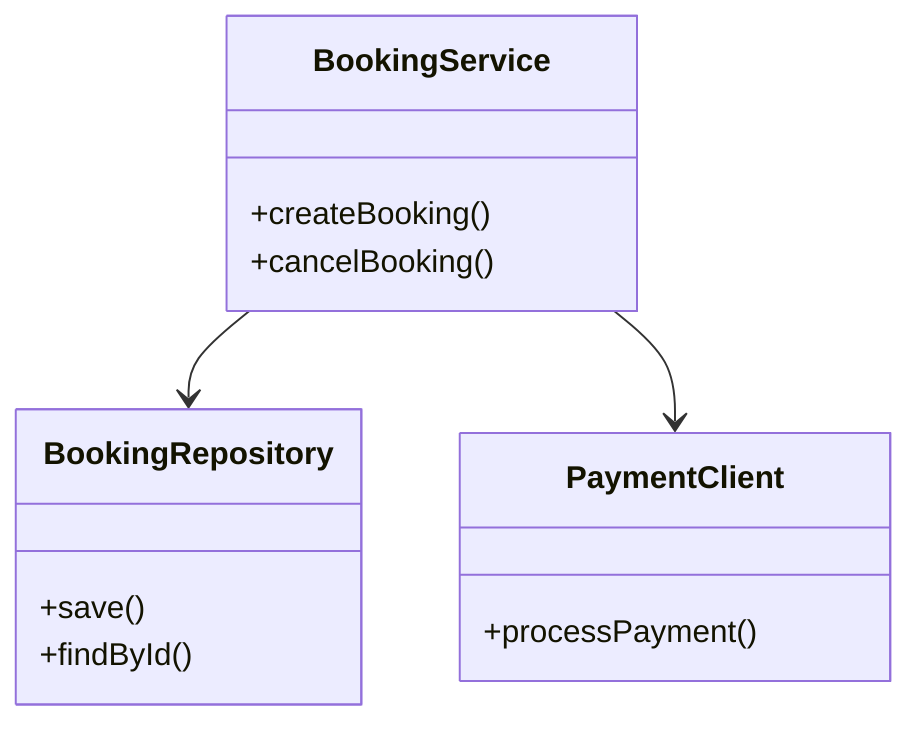
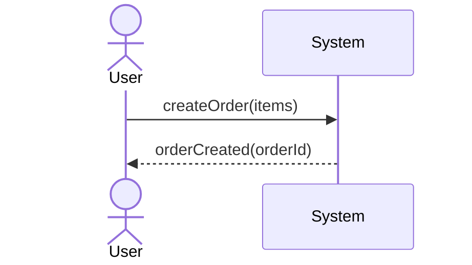
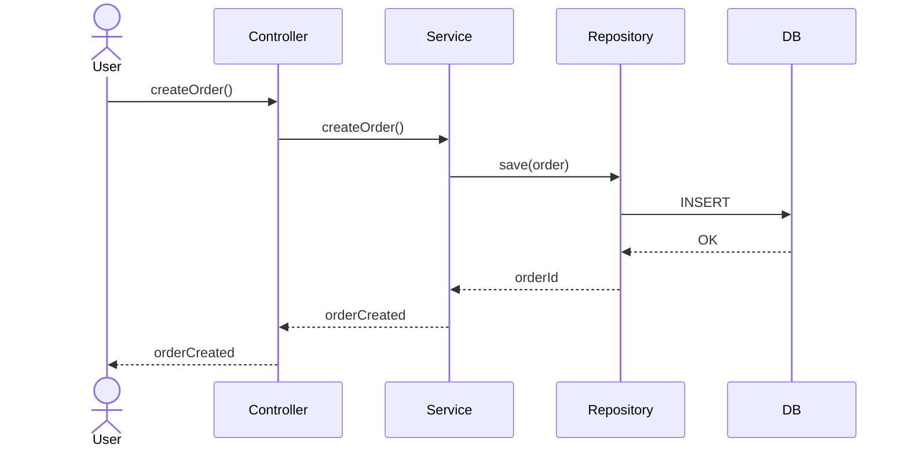
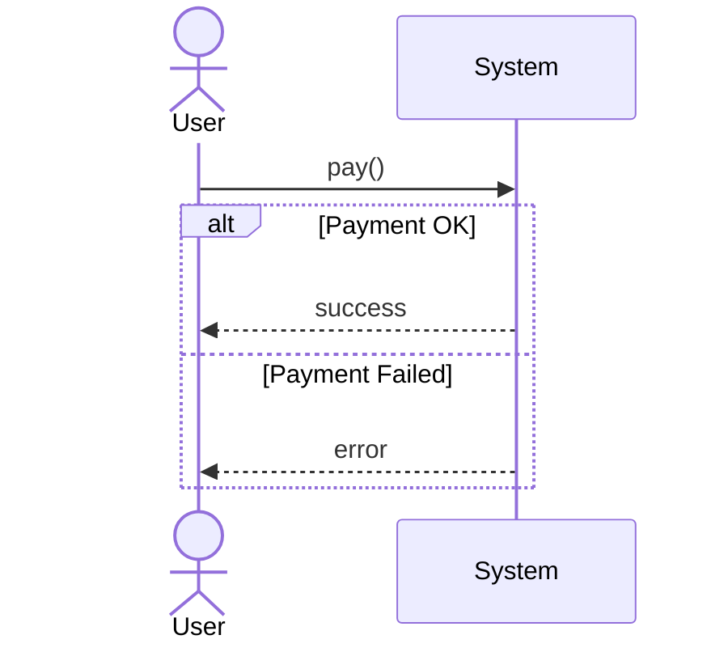

# Системное проектирование

# Лекция 4. Документирование архитектурных решений

**Длительность:** 90 минут

---

## Цели и ожидаемые результаты

* Создавать архитектурную документацию с использованием C4-модели.
* Формализовывать архитектурные решения в формате ADR.
* Документировать риски, компромиссы и нефункциональные требования.
* Определять необходимый уровень строгости документации в зависимости от контекста проекта.

---

## План и тайминг

1. Архитектура как живой документ — 15 мин
2. C4-модель: структурированная визуализация — 20 мин
3. ADR: фиксация архитектурных решений — 25 мин
4. Документирование рисков и компромиссов — 20 мин
5. Вопросы и обсуждение — 10 мин

---

# Раздел 1. Архитектура как живой документ

## 1.1. Архитектурная документация: определение и назначение

**Архитектурная документация** — это структурированное и формализованное описание архитектурных решений, ограничений, допущений, рисков и характеристик системы, предназначенное для обеспечения согласованности, управляемости и эволюции архитектуры на протяжении жизненного цикла программного продукта.

Она фиксирует:

* структуру системы (границы, компоненты, контейнеры);
* принятые архитектурные решения;
* обоснование этих решений;
* нефункциональные требования;
* ключевые зависимости;
* архитектурные ограничения;
* архитектурные компромиссы (trade-offs).

Архитектурная документация является **артефактом архитектурного процесса** и относится к категории устойчивых (long-lived) инженерных артефактов.

---

## 1.2. Архитектура как процесс, а не статический документ

Архитектура — это не только структура системы, но и **процесс принятия и пересмотра архитектурных решений**.

Следовательно, архитектурная документация должна:

* отражать текущее состояние архитектуры (current state);
* фиксировать историю ключевых решений (decision history);
* поддерживать эволюцию архитектуры (architectural evolution);
* обеспечивать трассируемость решений (decision traceability).

Понятие **«живой документ»** означает:

* документ имеет владельца (document owner);
* существует процесс обновления;
* определены триггеры пересмотра;
* актуальность регулярно проверяется;
* документ включён в инженерный workflow (например, через pull request).

---

## 1.3. Аудитория архитектурной документации

Любая документация создаётся для конкретной аудитории. В архитектуре это принципиально важно, поскольку уровень абстракции и глубина детализации должны соответствовать целям использования.

Типовые аудитории:

### 1. Разработчики

Интересуются:

* границами модулей;
* зонами ответственности;
* контрактами взаимодействия;
* зависимостями;
* точками расширения.

### 2. Технические руководители (Tech Lead)

Интересуются:

* влиянием изменений на архитектуру;
* соответствием решений архитектурным принципам;
* архитектурными ограничениями;
* управлением техническим долгом.

### 3. SRE / DevOps

Интересуются:

* точками отказа (single points of failure);
* стратегией масштабирования;
* деплоймент-моделью;
* зависимостями от внешних систем;
* SLO/SLA и метриками.

### 4. Безопасность (Security)

Интересуется:

* зонами доверия (trust boundaries);
* схемой аутентификации и авторизации;
* доступом к данным;
* межсервисной коммуникацией;
* хранением секретов.

### 5. Менеджмент / бизнес

Интересуется:

* стоимостью изменений;
* влиянием архитектурных решений на time-to-market;
* рисками;
* устойчивостью к росту нагрузки.

Вывод: архитектурная документация — это инструмент **межфункциональной коммуникации**.

---

## 1.4. Сценарии использования архитектурной документации

Архитектурная документация должна поддерживать конкретные сценарии.

### 1. Онбординг

Обеспечивает формирование целостной модели системы:

* границы системы;
* основные контейнеры;
* взаимодействия;
* владение данными.

### 2. Ревью изменений

Позволяет:

* оценить влияние изменений (impact analysis);
* проверить соответствие архитектурным ограничениям;
* выявить новые зависимости;
* пересмотреть риски.

### 3. Эксплуатация

Используется для:

* определения критичных компонентов;
* анализа деградации характеристик;
* понимания резервирования и масштабирования;
* управления SLO.

### 4. Инциденты

Позволяет:

* быстро определить архитектурную область проблемы;
* понять поток взаимодействий;
* оценить каскадные эффекты отказа.

### 5. Соответствие требованиям (compliance)

Используется для:

* аудита безопасности;
* регуляторной проверки;
* подтверждения соблюдения нефункциональных требований.

---

## 1.5. Проблема «мёртвой документации»

**Мёртвая документация** — это документация, которая:

* не соответствует реальной архитектуре;
* не обновляется;
* не используется;
* не имеет владельца;
* не интегрирована в процессы команды.

Опасность мёртвой документации:

* формирование ложной ментальной модели системы;
* увеличение времени диагностики;
* ошибочные архитектурные решения;
* накопление архитектурного долга;
* снижение доверия к документации как к инструменту.

Архитектурная документация без механизма актуализации создаёт **операционный риск**.

---

## 1.6. Принципы качества архитектурной документации

### 1. Актуальность (Currency)

Документ должен:

* содержать дату обновления;
* иметь владельца;
* иметь триггеры пересмотра;
* быть синхронизированным с кодовой базой.

Триггеры обновления могут включать:

* принятие нового ADR;
* изменение SLA;
* изменение контейнерной структуры;
* добавление новой интеграции.

---

### 2. Фокус (Relevance)

Документация должна содержать:

* архитектурно значимые решения (architecturally significant decisions);
* нефункциональные требования;
* структурные элементы;
* ключевые зависимости.

Она не должна содержать:

* детали реализации;
* избыточную техническую детализацию;
* нестабильные элементы, не влияющие на структуру.

---

### 3. Структурированность (Structure)

Документация должна:

* иметь чёткую иерархию;
* быть логически организованной;
* использовать единую терминологию;
* поддерживать навигацию (оглавление, ссылки).

Структурированность снижает когнитивную нагрузку.

---

### 4. Проверяемость (Verifiability)

Архитектурная документация должна быть верифицируемой:

* утверждения можно сопоставить с кодом;
* SLO можно сопоставить с метриками;
* зависимости можно проверить через конфигурацию;
* деплоймент-модель отражена в CI/CD.

Проверяемость предотвращает рассинхронизацию документа и системы.

---

## 1.7. Архитектурная документация и жизненный цикл

Архитектурная документация сопровождает все стадии жизненного цикла:

1. Анализ требований — фиксируются ограничения и нефункциональные характеристики.
2. Проектирование — формируется структура и принимаются ключевые решения.
3. Разработка — уточняются и эволюционируют архитектурные решения.
4. Эксплуатация — документируются фактические показатели и ограничения.
5. Эволюция — добавляются новые ADR и пересматриваются допущения.

Таким образом, архитектурная документация — это не одноразовый артефакт, а **механизм управления архитектурной целостностью системы**.

---

## 1.8. Связь с архитектурным управлением (Architecture Governance)

Архитектурная документация является инструментом архитектурного управления (architecture governance), которое включает:

* контроль соблюдения архитектурных принципов;
* фиксацию архитектурных ограничений;
* управление архитектурными рисками;
* формализацию процесса принятия решений.

Без документирования архитектурные решения становятся неявными и неуправляемыми.

---

## 1.9. Ключевые понятия раздела

* Архитектурная документация
* Архитектурный артефакт
* Живой документ
* Актуальность (currency)
* Трассируемость решений (traceability)
* Архитектурно значимое решение
* Мёртвая документация
* Architecture governance
* Impact analysis
* Нефункциональные требования

---

## Итог раздела

Архитектурная документация — это формализованный инструмент фиксации структуры, решений и ограничений системы.
Она должна быть актуальной, структурированной, проверяемой и интегрированной в процессы команды.
Её цель — обеспечить управляемую эволюцию архитектуры, прозрачность решений и снижение операционных и организационных рисков.

---

# Раздел 2. C4-модель: структурированная визуализация архитектуры

## 2.1. Назначение C4-модели

**C4-модель** — это иерархический подход к описанию архитектуры программной системы через последовательные уровни детализации.

C4 = Context, Container, Component, Code.

Модель решает три ключевые задачи:

1. **Управление уровнем абстракции** — разные аудитории видят систему на подходящем уровне.
2. **Структурирование визуализации** — исключается смешение уровней.
3. **Снижение когнитивной перегрузки** — информация дозируется.

C4 — это не нотация (как UML), а **подход к декомпозиции архитектурного описания**.

---

## 2.2. Иерархия уровней C4

C4 основана на принципе прогрессивной детализации (progressive disclosure).
Каждый следующий уровень отвечает на более конкретный вопрос.

| Уровень   | Вопрос                                                 |
| --------- | ------------------------------------------------------ |
| Context   | Что это за система и в каком окружении она существует? |
| Container | Из каких исполняемых частей она состоит?               |
| Component | Из каких логических компонентов состоит контейнер?     |
| Code      | Как это реализовано в коде?                            |

Каждый уровень является самостоятельным артефактом.

---

## 2.3. Level 1 — Context Diagram

### Формальное определение

**Context Diagram** — это архитектурное представление системы как единого логического объекта, отображающее её взаимодействие с внешними участниками и внешними системами без раскрытия внутренней структуры.

Это самый высокий уровень абстракции в C4.

---

### Цель уровня Context

* определить **границу системы** (system boundary);
* зафиксировать **зоны ответственности**;
* выявить **внешние зависимости**;
* обозначить **интеграционные точки**;
* определить **границы доверия (trust boundaries)**.

Context-диаграмма отвечает на вопрос:

> Где заканчивается наша система и что находится вне её?

---

### Что обязательно должно быть отражено

1. **System under consideration**
2. **External actors**
3. **External systems**
4. **Тип взаимодействия (высокоуровневый)**

Не отображаются:

* контейнеры;
* базы данных;
* технологии;
* внутренняя декомпозиция.

---

### Пример: Онлайн-платформа бронирования билетов



---

### Терминологические акценты

* **External dependency** — система, находящаяся вне зоны архитектурного контроля.
* **Actor** — субъект взаимодействия (человек или роль).
* **Integration point** — логическая точка обмена данными.
* **Trust boundary** — граница изменения уровня доверия.

---

### Типовые ошибки

* указание технологий (например, PostgreSQL);
* указание контейнеров (frontend/backend);
* детализация потоков на уровне событий.

---

## 2.4. Level 2 — Container Diagram

### Формальное определение

**Container Diagram** — это представление системы в виде исполняемых единиц (runtime units), взаимодействующих друг с другом через определённые протоколы.

Контейнер — это:

* разворачиваемая единица;
* изолированный процесс или сервис;
* база данных;
* фронтенд-приложение.

---

### Назначение уровня Container

* зафиксировать крупные архитектурные блоки;
* описать способы взаимодействия;
* указать используемые технологии на верхнем уровне;
* выявить точки масштабирования.

Container-диаграмма отвечает на вопрос:

> Из каких исполняемых частей состоит система?

---

### Пример: та же система бронирования



---

### Терминологические элементы

* **Runtime boundary** — граница выполнения.
* **Deployment unit** — единица деплоя.
* **Synchronous communication** — блокирующий вызов.
* **Asynchronous communication** — неблокирующий обмен через события.
* **Data store** — контейнер хранения.

---

### Важно фиксировать

* направление потоков;
* протокол (HTTP, gRPC, SQL, Event);
* синхронность;
* технологию на уровне класса (например, “relational DB”).

---

### Что не указывается

* схема БД;
* конфигурация Kubernetes;
* конкретные таблицы.

---

## 2.5. Level 3 — Component Diagram

### Формальное определение

**Component Diagram** — это декомпозиция одного контейнера на логические компоненты, отражающая распределение ответственности и зависимости внутри него.

Компонент — это:

* логический модуль;
* сервисный слой;
* адаптер;
* агрегат бизнес-логики.

Компонент не равен классу. Это архитектурная единица ответственности.

---

### Назначение

* показать распределение ролей;
* выявить внутренние зависимости;
* проверить направленность зависимостей;
* выявить возможные нарушения архитектурных принципов.

Component-уровень отвечает на вопрос:

> Как структурирована логика внутри контейнера?

---

### Пример: Backend API контейнер



---

### Архитектурные принципы на уровне компонентов

* **Single Responsibility Principle**
* **Dependency Inversion**
* **Low Coupling**
* **High Cohesion**

---

### Терминологические акценты

* **Responsibility allocation** — распределение ответственности.
* **Inbound adapter** — входной адаптер (например, REST).
* **Outbound adapter** — исходящий адаптер (например, клиент платёжной системы).
* **Dependency direction** — направление зависимости.
* **Layered separation** — слоистая структура.

---

### Что выявляется на этом уровне

* циклические зависимости;
* нарушение слоёв;
* чрезмерная связность;
* отсутствие абстракций.

---

## 2.6. Level 4 — Code Diagram

### Формальное определение

**Code Level** — это детализация архитектурного решения до уровня классов, интерфейсов и модулей.

Этот уровень:

* необязателен;
* используется для архитектурно значимых частей;
* часто заменяется ссылкой на репозиторий.

---

### Назначение

* зафиксировать реализацию паттернов;
* показать абстракции;
* показать dependency injection;
* отразить важные интерфейсы.

---

### Пример: реализация слоя сервиса



---

### Терминология

* **Interface contract**
* **Abstraction**
* **Concrete implementation**
* **Dependency injection**
* **Architectural pattern**

---

### Когда использовать Level 4

* при критических бизнес-алгоритмах;
* при реализации сложных паттернов (CQRS, Saga);
* при аудите безопасности;
* при code-level review архитектурных ограничений.

---

## Связь уровней между собой

Уровни образуют иерархию:

Context
↓
Container
↓
Component
↓
Code

Каждый уровень:

* уточняет предыдущий;
* не дублирует его;
* сохраняет согласованность.

## 2.7. Границы уровней (Separation of Concerns)

C4 основана на строгом разделении уровней абстракции.

Недопустимые ошибки:

* размещение технологических деталей на Context-уровне;
* показ компонентов на Container-уровне;
* смешение инфраструктуры и логики без обозначения границ.

Каждый уровень:

* самостоятельный;
* не дублирует детали другого уровня;
* уточняет предыдущий.

Это соответствует принципу **Separation of Concerns**.

---

## 2.8. Отношения и типы связей

Связь в C4 — это семантически осмысленное отношение.

Типы связей:

* request/response
* publish/subscribe
* data replication
* event notification
* authentication flow

Важно фиксировать:

* синхронность/асинхронность;
* направление потока данных;
* характер взаимодействия.

Связь должна описывать:

* что передаётся;
* в каком направлении;
* с какой целью.

---

## 2.9. Подписи и легенда

Качественная C4-диаграмма содержит:

* заголовок;
* уровень (Context/Container/...);
* версию;
* легенду (обозначения);
* описание ограничений (scope notes).

Это обеспечивает:

* интерпретируемость;
* проверяемость;
* отсутствие двусмысленности.

---

## 2.10. C4 и нефункциональные характеристики

C4 напрямую не описывает:

* SLA
* latency
* throughput

Но:

* позволяет визуализировать зоны влияния;
* помогает выявить single points of failure;
* упрощает анализ масштабируемости;
* упрощает анализ зон доверия.

C4 — инструмент структурного описания, который служит основой для анализа характеристик.

---

## 2.11. Ограничения C4-модели

C4:

* не является стандартом нотации;
* не описывает поведенческую динамику подробно;
* не заменяет sequence-диаграммы;
* не фиксирует временные характеристики.

Для сложных взаимодействий дополнительно используются:

* sequence diagrams;
* event flow diagrams;
* state diagrams.

---

## 2.12. Инструменты реализации

C4 может быть реализована через:

* Mermaid
* Structurizr
* PlantUML
* Diagrams as Code
* визуальные редакторы

Принципиально важно:

* хранение в version control;
* возможность ревью;
* трассируемость изменений.

---

## 2.13. Ключевые понятия раздела

* C4-model
* Context Diagram
* Container Diagram
* Component Diagram
* Code Level
* System boundary
* Deployment unit
* Responsibility
* Coupling / Cohesion
* Progressive disclosure
* Separation of Concerns

---

## Итог раздела

C4-модель — это структурированный подход к многоуровневому описанию архитектуры.
Она обеспечивает контроль уровня абстракции, разделение ответственности и прозрачность границ системы.
C4 не заменяет другие виды диаграмм, а задаёт каркас визуального описания архитектуры.

---

# Раздел 3. ADR: фиксация архитектурных решений

## 3.1. Определение и назначение ADR

**ADR (Architecture Decision Record)** — это формализованный документ, фиксирующий архитектурно значимое решение, его контекст, альтернативы, обоснование выбора и последствия.

ADR отвечает на вопрос:

> Почему было принято именно это архитектурное решение?

Важно: ADR фиксирует **причину выбора**, а не описание реализации.

---

## 3.2. Архитектурно значимое решение (Architecturally Significant Decision)

Не каждое техническое решение требует ADR.

**Архитектурно значимое решение** — это решение, которое:

* влияет на структуру системы;
* влияет на нефункциональные характеристики;
* влияет на эксплуатацию;
* имеет несколько альтернатив;
* имеет высокую стоимость изменения (high cost of change);
* затрагивает несколько команд или доменов;
* вводит долгосрочные ограничения.

Примеры типов решений:

* выбор архитектурного стиля (монолит / микросервисы);
* выбор модели взаимодействия (REST / gRPC / event-driven);
* выбор стратегии консистентности;
* выбор модели хранения данных;
* стратегия масштабирования;
* стратегия аутентификации.

---

## 3.3. Цели использования ADR

ADR используется для:

1. **Трассируемости решений (Decision Traceability)**
2. **Снижения архитектурной энтропии**
3. **Передачи знаний**
4. **Фиксации компромиссов**
5. **Управления архитектурной эволюцией**

Без ADR архитектурные решения становятся:

* неявными;
* забываемыми;
* противоречивыми;
* труднообъяснимыми.

---

## 3.4. Жизненный цикл ADR

ADR имеет состояние (status):

* **Proposed** — решение предложено
* **Accepted** — принято
* **Rejected** — отклонено
* **Superseded** — заменено другим решением
* **Deprecated** — устарело

Жизненный цикл обеспечивает управляемую эволюцию архитектуры.

---

## 3.5. Структура ADR (ядро)

Минимально необходимая структура:

1. **Title**
2. **Status**
3. **Context**
4. **Problem Statement**
5. **Options**
6. **Decision**
7. **Consequences**

---

## 3.6. Разбор структуры с примером

### Пример: выбор модели взаимодействия между сервисами

---

### ADR-007: Выбор модели межсервисного взаимодействия

**Status:** Accepted
**Date:** 2026-02-10

---

### Context

Система состоит из 8 сервисов.
Ожидаемая нагрузка — до 15k RPS.
Требуется высокая отказоустойчивость.
Часть операций допускает eventual consistency.

---

### Problem

Определить модель взаимодействия между сервисами:

* синхронные HTTP-запросы
* gRPC
* асинхронная модель через брокер сообщений

---

### Options

1. REST over HTTP
2. gRPC
3. Event-driven (Kafka)

---

### Decision

Выбрана **гибридная модель**:

* синхронные вызовы для query-операций;
* асинхронные события для бизнес-транзакций.

---

### Consequences

Положительные:

* снижение связности;
* повышение отказоустойчивости;
* лучшая масштабируемость.

Отрицательные:

* усложнение трассировки;
* необходимость idempotency;
* eventual consistency.

Риски:

* сложность отладки распределённых транзакций.

---

## 3.7. Формат MADR

**MADR (Markdown ADR)** — облегчённый, практичный формат для Git-репозитория.

Типовая структура:

```markdown
# Title

## Context
...

## Decision
...

## Alternatives
...

## Consequences
...
```

Преимущества:

* version-controlled;
* ревьюится через pull request;
* интегрируется в CI/CD.

---

## 3.8. Y-Statement

**Y-Statement** — это структурированная формула краткой фиксации архитектурного решения.
Используется как компактная форма выражения сути ADR.

---

### Назначение

Y-Statement позволяет:

* чётко сформулировать мотивацию решения;
* явно указать цель;
* зафиксировать компромиссы;
* избежать расплывчатых формулировок;
* проверить логическую обоснованность выбора.

Если решение невозможно выразить через Y-Statement — оно, вероятно, не сформулировано корректно.

---

### Формальная структура

> В контексте **<условия / ограничений>**
> мы решили **<архитектурное решение>**
> чтобы **<достичь цели / удовлетворить NFR>**
> принимая **<компромиссы / последствия>**.

Структура включает четыре обязательных элемента:

1. **Контекст** — технические или бизнес-ограничения.
2. **Решение** — конкретный архитектурный выбор.
3. **Цель** — какой атрибут качества или требование удовлетворяется.
4. **Компромисс** — негативные последствия или ограничения.

---

### Логическая роль каждого элемента

* **Контекст** устраняет абстрактность и делает решение привязанным к условиям.
* **Решение** должно быть конкретным и проверяемым.
* **Цель** связывает решение с NFR или бизнес-ценностью.
* **Компромисс** фиксирует trade-off.

---

### Пример 1 (масштабируемость)

> В контексте роста нагрузки до 20k RPS
> мы решили внедрить горизонтальное масштабирование через auto-scaling
> чтобы обеспечить p95 < 200 ms
> принимая увеличение инфраструктурных затрат.

---

### Пример 2 (отказоустойчивость)

> В контексте требования SLA 99.99%
> мы решили использовать multi-zone deployment
> чтобы повысить доступность
> принимая усложнение инфраструктуры и мониторинга.

---

### Пример 3 (консистентность vs доступность)

> В контексте распределённой системы с глобальными пользователями
> мы решили использовать eventual consistency
> чтобы обеспечить высокую доступность
> принимая временную несогласованность данных.

---

### Связь с ADR

* не заменяет ADR;
* является его краткой формой;
* часто используется в начале документа как summary;
* помогает при архитектурных ревью.

---

## 3.9. System Sequence Diagram (SSD)

**System Sequence Diagram (SSD)** — диаграмма взаимодействия актор ↔ система, где система рассматривается как **чёрный ящик**.

Показывает:

* какие операции вызывает актор;
* какие ответы возвращает система;
* порядок событий.

Не показывает:

* сервисы;
* базу данных;
* внутреннюю архитектуру.

### Когда используется

* анализ требований;
* формализация use case;
* определение API-контрактов;
* уточнение границы системы.

### Пример SSD

Сценарий: создание заказа.



Система — единый блок.

---

## 3.10. UML Sequence Diagram

### Что это

**UML Sequence Diagram** — диаграмма взаимодействия объектов/компонентов во времени.

Показывает:

* последовательность вызовов;
* синхронность/асинхронность;
* вложенность операций;
* альтернативные сценарии.

Раскрывает внутреннюю структуру.

### Когда используется

* проектирование логики;
* анализ распределённых вызовов;
* проверка транзакционных границ;
* поиск узких мест.

### Пример UML Sequence

Тот же сценарий, но с детализацией:



### Ключевые различия

| SSD                   | UML Sequence                  |
| --------------------- | ----------------------------- |
| Система — чёрный ящик | Раскрыта внутренняя структура |
| Уровень требований    | Уровень проектирования        |
| Актор ↔ система       | Объект ↔ объект               |

### Элементы UML Sequence

* **Lifeline** — участник взаимодействия
* **Message** — сообщение
* **Activation** — период выполнения
* **alt / loop / opt / par** — условные блоки

Пример альтернативы:



### Связь с архитектурой

* SSD помогает определить границу системы (Level 1 C4).
* UML Sequence помогает анализировать взаимодействия контейнеров или компонентов (Level 2–3 C4).
* Используется для проверки влияния решений (ADR).
* Позволяет оценивать latency и синхронные зависимости (NFR).

---

## 3.11. ADR и нефункциональные характеристики

ADR часто фиксируют решения, связанные с:

* производительностью;
* доступностью;
* отказоустойчивостью;
* безопасностью;
* масштабируемостью.

ADR должен явно указывать:

* какие характеристики улучшаются;
* какие ухудшаются;
* какие метрики затрагиваются.

---

## 3.12. ADR и архитектурные компромиссы

Любое значимое решение содержит trade-off.

ADR должен фиксировать:

* какие альтернативы рассматривались;
* какие качества улучшены;
* какую цену платит система;
* какие риски появляются.

---

## 3.13. ADR и эволюция архитектуры

ADR образуют хронологию архитектурных решений.

Пример эволюции:

* ADR-001: Монолит
* ADR-012: Выделение сервиса платежей
* ADR-021: Переход на event-driven

Таким образом, ADR выполняют роль архитектурного журнала (architectural log).

---

## 3.14. Частые ошибки при ведении ADR

1. Описание реализации вместо причины.
2. Отсутствие альтернатив.
3. Отсутствие последствий.
4. Фиксация слишком мелких решений.
5. Отсутствие статуса.
6. Отсутствие обновления при изменении архитектуры.

---

## 3.15. Когда ADR не нужен

ADR не требуется для:

* локальных рефакторингов;
* выбора библиотеки внутри компонента;
* мелких оптимизаций;
* решений без архитектурного влияния.

---

## 3.16. ADR и governance

ADR является инструментом:

* архитектурного контроля;
* прозрачности решений;
* коллективной ответственности;
* предотвращения «архитектуры по памяти».

---

## 3.17. Ключевые понятия раздела

* Architecture Decision Record
* Architecturally Significant Decision
* Decision Traceability
* Trade-off
* Consequences
* Superseded
* MADR
* Y-Statement
* Cost of Change

---

## Итог раздела

ADR — это механизм фиксации причин архитектурных решений.
Он обеспечивает прозрачность, трассируемость и управляемую эволюцию архитектуры.
Без ADR архитектурные решения становятся неявными и неконтролируемыми, что увеличивает технический и организационный риск.

---

# Раздел 4. Нефункциональные требования и атрибуты качества

---

## 4.1. Определение нефункциональных требований (NFR)

**Нефункциональные требования (Non-Functional Requirements, NFR)** — это требования, описывающие *как* система должна работать, а не *что* она должна делать.

Если функциональные требования определяют поведение системы, то NFR определяют её **характеристики качества**.

NFR формируют ограничения и критерии приемки архитектурных решений.

---

## 4.2. Атрибуты качества (Quality Attributes)

**Атрибут качества** — измеряемое свойство системы, влияющее на её эксплуатационные характеристики.

Атрибут качества включает:

* стимул (stimulus);
* среду (environment);
* артефакт (artifact);
* реакцию (response);
* измеримую метрику (response measure).

Это называется **quality attribute scenario**.

---

## 4.3. Ключевые атрибуты качества

### 1. Производительность (Performance)

Характеризует способность системы обрабатывать нагрузку.

Метрики:

* latency;
* throughput;
* RPS;
* p95 / p99;
* время отклика.

---

### 2. Масштабируемость (Scalability)

Способность системы увеличивать производительность при росте ресурсов.

Типы:

* горизонтальная;
* вертикальная;
* функциональная.

---

### 3. Доступность (Availability)

Вероятность того, что система доступна для использования.

Метрики:

* SLA;
* uptime;
* MTTR;
* MTBF.

---

### 4. Надёжность (Reliability)

Способность системы корректно функционировать без сбоев.

Отличается от доступности:

* доступность — можно ли подключиться;
* надёжность — работает ли корректно.

---

### 5. Отказоустойчивость (Fault Tolerance)

Способность продолжать работу при сбоях компонентов.

Механизмы:

* репликация;
* failover;
* retry;
* circuit breaker;
* graceful degradation.

---

### 6. Безопасность (Security)

Защита системы от несанкционированного доступа.

Компоненты:

* аутентификация;
* авторизация;
* шифрование;
* аудит;
* контроль доступа.

---

### 7. Поддерживаемость (Maintainability)

Способность системы к модификации и развитию.

Включает:

* модульность;
* читаемость;
* тестируемость;
* документированность;
* изоляцию изменений.

---

### 8. Расширяемость (Extensibility)

Способность добавлять новые функции без изменения существующего кода.

Связана с:

* открытостью/закрытостью;
* plugin-архитектурой;
* слабой связностью.

---

### 9. Наблюдаемость (Observability)

Способность понимать внутреннее состояние системы через внешние сигналы.

Компоненты:

* логирование;
* метрики;
* трассировка;
* алерты.

---

## 4.4. Quality Attribute Scenario (структурирование NFR)

Формализованный сценарий качества включает:

1. **Source of stimulus** — источник воздействия
2. **Stimulus** — событие
3. **Environment** — условия
4. **Artifact** — затрагиваемый компонент
5. **Response** — реакция
6. **Response measure** — измерение реакции

---

### Пример формализации

**Stimulus:** увеличение нагрузки до 10k RPS
**Environment:** production
**Artifact:** API Gateway
**Response:** система масштабируется
**Response measure:** latency < 200 ms при p95

---

## 4.5. Связь NFR с архитектурными решениями

Архитектура — это инструмент достижения NFR.

Примеры связи:

* Высокая доступность → репликация + балансировка
* Масштабируемость → stateless сервисы
* Безопасность → zero trust + RBAC
* Наблюдаемость → централизованные логи

Архитектурные решения всегда являются реакцией на NFR.

---

## 4.6. Конфликты атрибутов качества

Атрибуты качества часто находятся в конфликте.

Типичные конфликты:

* Производительность ↔ Безопасность
* Консистентность ↔ Доступность
* Гибкость ↔ Производительность
* Простота ↔ Масштабируемость

Архитектура — это управление компромиссами между атрибутами качества.

---

## 4.7. Неформализованные NFR — источник риска

Проблема:

* «Система должна быть быстрой»
* «Система должна быть надёжной»

Без метрик NFR не проверяемы.

Правильная формулировка:

* p95 < 150 ms
* SLA 99.95%
* MTTR < 15 минут

---

## 4.8. NFR и Cost of Change

Чем позже выявлены NFR, тем дороже их внедрение.

Пример:

* Добавление шифрования после релиза
* Добавление масштабируемости после роста нагрузки
* Добавление логирования после инцидента

NFR должны фиксироваться на этапе проектирования.

---

## 4.9. NFR и ADR

Связь:

* NFR формируют требования;
* ADR фиксируют решения для достижения NFR.

Пример:

NFR: SLA 99.9%
ADR: внедрение multi-zone deployment.

---

## 4.10. Архитектурные тактики (Architectural Tactics)

**Тактика** — базовый архитектурный механизм, направленный на достижение атрибута качества.

Примеры:

* Retry — повышение надёжности
* Caching — повышение производительности
* Replication — повышение доступности
* Circuit Breaker — повышение отказоустойчивости
* Load Balancing — повышение масштабируемости

Тактики — это строительные блоки архитектурных стратегий.

---

## 4.11. Anti-pattern: NFR как постфактум

Частая ошибка — рассматривать NFR после реализации функционала.

Последствия:

* архитектурные переделки;
* рост технического долга;
* деградация производительности;
* инциденты в production.

---

## 4.12. Ключевые понятия раздела

* Non-Functional Requirements
* Quality Attributes
* Quality Attribute Scenario
* Availability
* Reliability
* Scalability
* Fault Tolerance
* Observability
* Trade-off
* Architectural Tactics

---

## Итог раздела

Нефункциональные требования определяют форму архитектуры.
Архитектура — это способ достижения атрибутов качества через структурные решения и тактики.
Без явной формализации NFR архитектура становится реактивной и неконтролируемой.

---

# Ключевые выводы

* Документация — это инструмент управления сложностью.
* C4 помогает структурировать архитектуру.
* ADR фиксирует причины решений.
* Риски и компромиссы должны быть явно задокументированы.
* Уровень строгости зависит от контекста бизнеса.

---

# Вопросы для самопроверки

## Базовый минимум

1. В чём разница между архитектурой и реализацией?
2. Что такое C4-модель?
3. Перечислите четыре уровня C4.
4. Что такое ADR?
5. Что такое нефункциональные требования (NFR)?
6. Что такое атрибут качества?

## Средний нормис

1. Почему на уровне Context нельзя указывать технологии?
2. В чём отличие компонента от класса?
3. Когда требуется Level 4 (Code)?
4. Что такое Architecturally Significant Decision?
5. Какие элементы обязательно должны присутствовать в ADR?
6. Что такое trade-off в архитектуре?
7. Почему NFR формируют архитектуру?
8. Объясните различие между доступностью и отказоустойчивостью.
9. Что такое Quality Attribute Scenario?
10. Какие метрики используются для измерения производительности?
11. Почему «система должна быть быстрой» — некорректное требование?
12. Как связаны ADR и NFR?

## Роскошный максимум

1. Опишите границы ответственности на уровне Context.
2. Почему компонентная диаграмма помогает выявлять циклические зависимости?
3. В каких случаях C4 может быть избыточной?
4. Когда ADR не нужен?
5. Опишите жизненный цикл ADR.
6. Какие риски возникают при отсутствии ADR?
7. Приведите пример конфликта атрибутов качества.
8. Какие архитектурные тактики используются для повышения доступности?
9. Какие тактики повышают производительность?
10. Как изменение SLA влияет на архитектуру?
11. Почему невозможно максимизировать все атрибуты качества одновременно?
12. В чём разница между масштабируемостью и производительностью?
13. Почему observability критична для распределённых систем?
14. Как микросервисная архитектура влияет на NFR?

---
