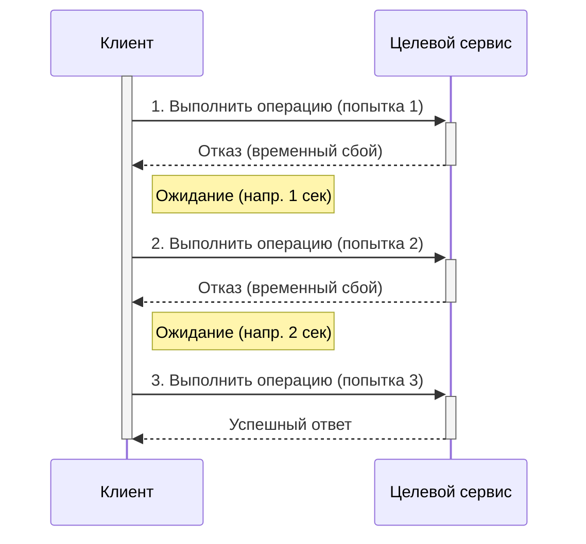
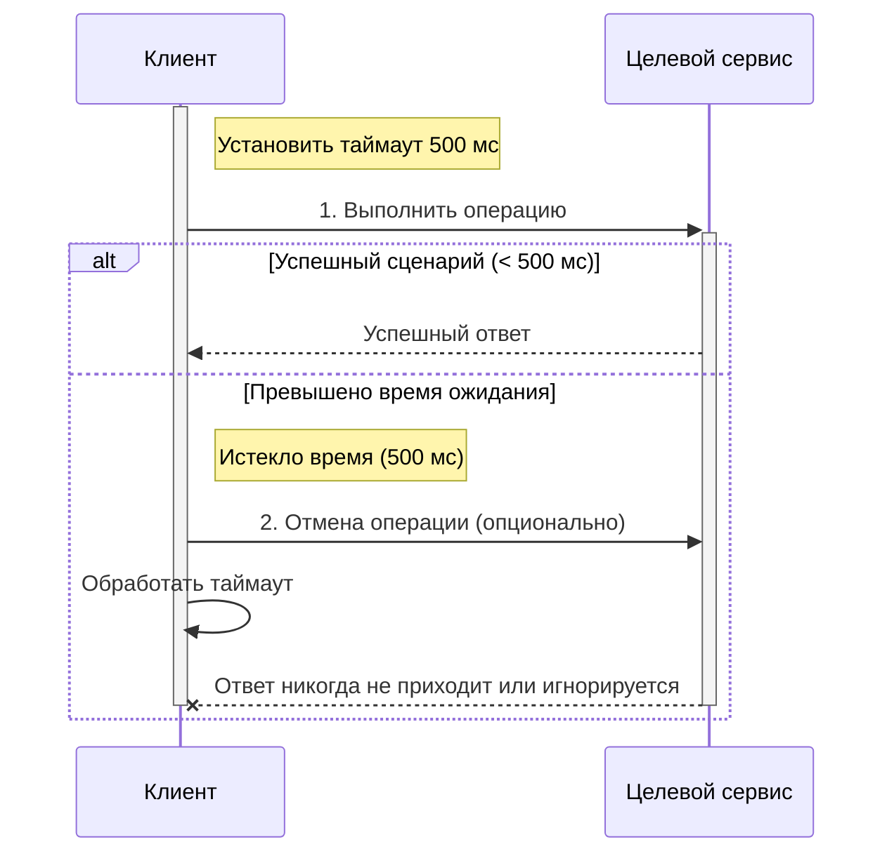
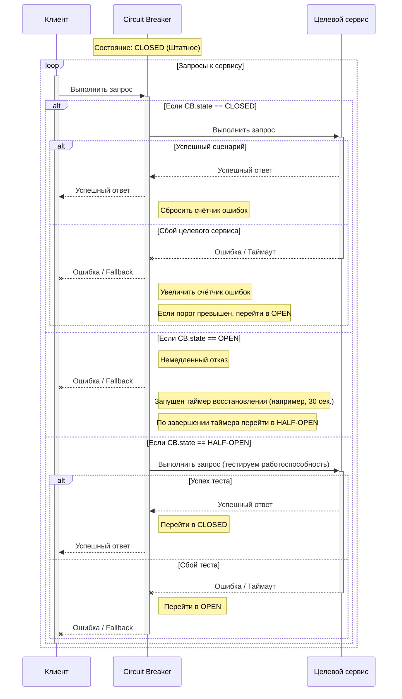
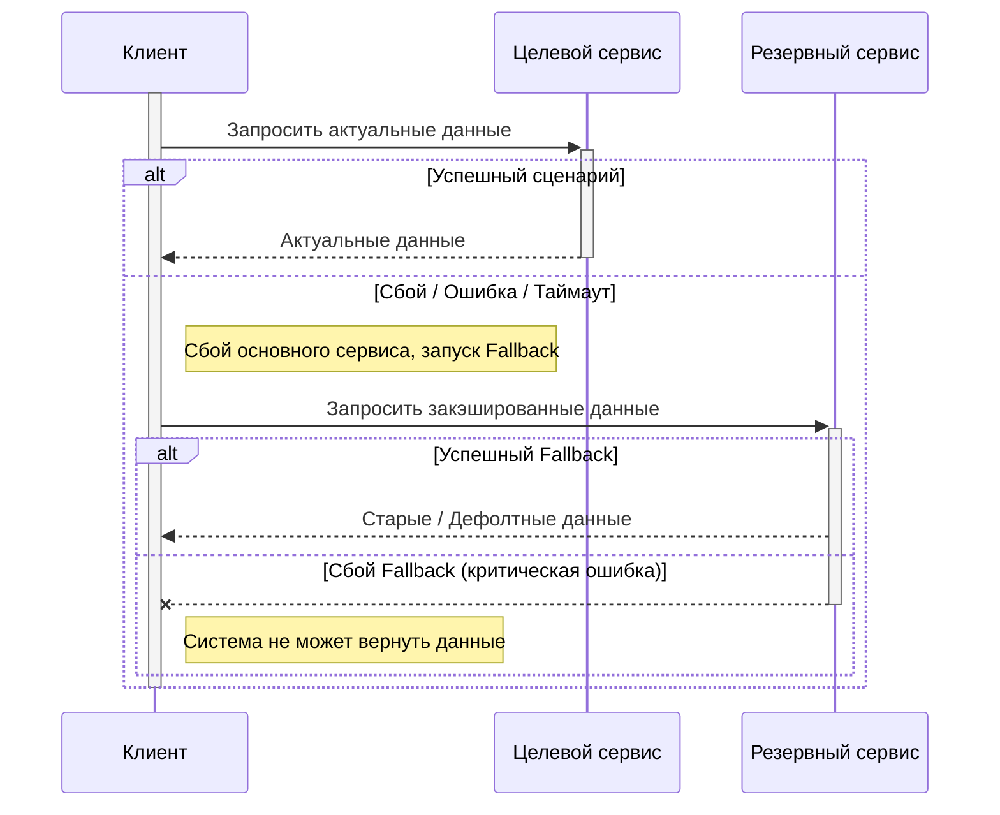
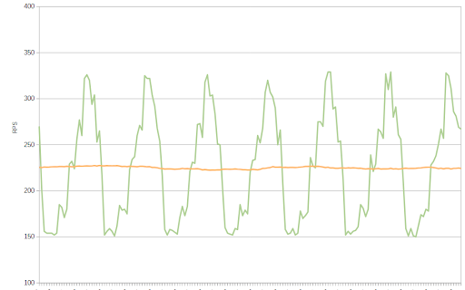
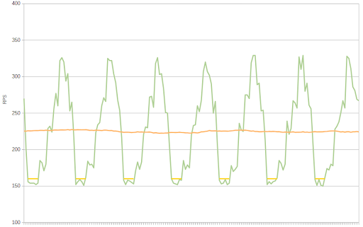
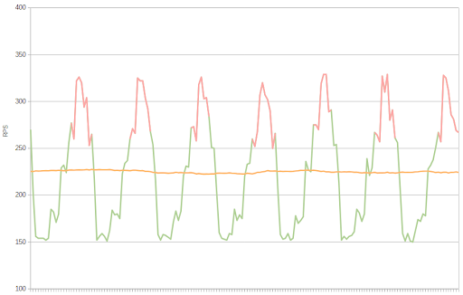
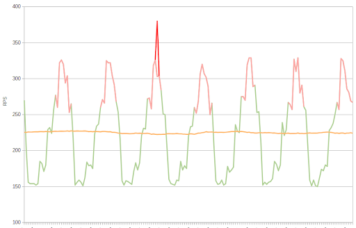
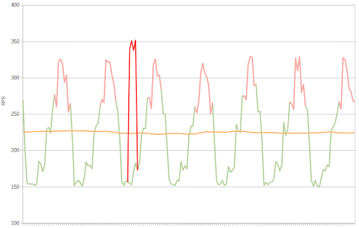

# Глава 5. Масштабируемость, отказоустойчивость и управление рисками

## Введение

Сегодня мы поговорим об очень важной теме для любой архитектуры – это масштабируемость, отказоустойчивость и управление
рисками. Почему это так важно? Посмотрите на системы, которыми мы пользуемся каждый день – стриминговые сервисы,
мессенджеры, банковские приложения, онлайн-магазины. Никто из пользователей не задумывается о том, что где-то в мире
прямо сейчас идёт огромный наплыв запросов, а серверы перегружены. Для пользователя важно одно: чтобы сервис работал
быстро и всегда был доступен. Но с точки зрения архитектора и разработчика это означает постоянное напряжение: как
сделать так, чтобы система выдерживала миллионы пользователей, не падала при сбое одного сервера, сохраняла данные даже
при отключении дата-центра и при этом оставалась управляемой?

Мы с вами будем обсуждать несколько ключевых вещей:
 - Масштабируемость – как из одного сервера вырасти до распределённой системы и не развалиться;
 - Отказоустойчивость – что делать, когда что-то сломается (а оно обязательно сломается);
 - Нагрузки – как предсказывать и моделировать поведение системы в пиковые моменты, чтобы в «чёрную пятницу» или во
время вирусного видео пользователи всё равно могли пользоваться продуктом.
 - SLI/SLO/SLA – набор метрик и соглашений, которые помогают архитекторам и бизнесу разговаривать на одном языке: что
именно мы гарантируем пользователю и как мы это будем измерять.

**Важный момент**: это не просто технические термины. Это напрямую связано с репутацией бизнеса и деньгами компании.
Например:
 - если банковское приложение недоступно хотя бы 15 минут – это может стоить компании миллионов рублей и потерянных
клиентов;
 - если у маркетплейса в пиковый момент падает корзина – пользователи уходят к конкурентам;
 - если у онлайн-игры появляются задержки в 500 мс – пользователи массово пишут в поддержку и перестают платить.
Поэтому архитектор в современном мире должен уметь проектировать так, чтобы система не только «работала на ноутбуке
разработчика», но и выдерживала реальные нагрузки, была устойчива к сбоям и давала бизнесу прогнозируемое качество
сервиса.

Тема этой главы – это своего рода тренировка мышления архитектора:
 - мы научимся видеть, где система может «просесть» при росте нагрузки;
 - узнаем, какие паттерны применяются для повышения устойчивости;
 - разберём, как измерять архитектурное качество.

## 1. Масштабируемость: от одного узла к распределённой системе

Когда мы начинаем проект, кажется: «Да зачем вообще думать о масштабируемости? У нас ведь всего несколько десятков
пользователей». Но реальность часто подкидывает сюрпризы. Представьте: вы сделали сервис, им вдруг заинтересовался
популярный блогер, и к вам пришли десятки тысяч пользователей за час. Серверы падают, пользователи пишут гневные отзывы.
Именно для таких случаев мы и проектируем масштабируемую архитектуру.

Главная идея масштабируемости – способность системы расти вместе с нагрузкой. Но расти можно по-разному, и это приводит
нас к двум базовым стратегиям.

### Типы масштабирования

#### Вертикальное масштабирование
Вертикальное масштабирование (scale-up) – это когда мы «накачиваем» один сервер: добавляем больше процессоров, памяти,
дисков.

Плюсы:
 - проще всего: не требует менять архитектуру и код;
 - можно реализовать быстро – «купили машину помощнее и забыли».

Минусы:
 - дорого: мощные серверы стоят несоразмерно дороже обычных;
 - есть физический предел – бесконечно увеличивать процессоры или память нельзя.

Обычно вертикальное масштабирование – это первый шаг. Оно хорошо работает для прототипов, небольших проектов, систем с
прогнозируемой нагрузкой.

#### Горизонтальное масштабирование
Горизонтальное масштабирование (scale-out) – это добавление новых узлов в систему. Мы не усиливаем один сервер, а
строим «ферму» из множества серверов.

Плюсы:
 - практически бесконечное расширение;
 - можно наращивать постепенно, по мере роста нагрузки.

Минусы:
 - требует изменения архитектуры: сервисы должны быть stateless, а данные – распределёнными;
 - нужна балансировка нагрузки и реализация механизмов отказоустойчивости. 

Горизонтальное масштабирование – это стандарт для крупных систем: соцсети, интернет-магазины, стриминговые сервисы.
Именно оно позволяет системам выдерживать миллионы пользователей одновременно.

### Принципы горизонтального масштабирования

Чтобы масштабирование реально работало, архитектура должна соблюдать несколько принципов:
 - **Stateless-компоненты**. Каждый экземпляр сервиса должен быть независим от контекста. Если сервис хранит сессии или
состояние у себя в памяти, то при добавлении нового узла мы столкнёмся с проблемой несогласованности. Поэтому состояние
выносят во внешние хранилища – базы данных, кэши (например, Redis), брокеры сообщений.
 - **Балансировка нагрузки**. Когда у нас десятки или сотни серверов, нужно уметь равномерно распределять запросы. Для
этого применяются балансировщики – Nginx, HAProxy, AWS Elastic Load Balancer. Балансировщики также помогают в случае
отказа узла: они убирают его из пула.
 - **Масштабирование источников данных**. Данные – это самое сложное. Просто дублировать сервера мало: нужно, чтобы все
экземпляры имели доступ к актуальной информации. Здесь применяются:
  - Репликация – копирование данных на несколько серверов для отказоустойчивости и быстрого чтения.
  - Шардирование – разделение данных на сегменты. Например, пользователи с ID от 1 до 1 млн. хранятся на одном
сервере, от 1 млн. + 1 до 2 млн – на другом, и т. п.
  - Кеширование – хранение часто запрашиваемых данных в памяти для ускорения работы.

### Масштабируемость источников данных

Архитектура базы данных – это то, что чаще всего становится «бутылочным горлышком».
 - **Шардирование**. Представьте интернет-магазин с миллионами заказов. Если все они хранятся в одной базе, любой
аналитический запрос «положит» сервер. При шардировании мы делим данные по некоторому признаку: по ID клиента,
по гео-позиции, по дате. Это снижает нагрузку на каждую отдельную базу и позволяет масштабировать систему линейно.
 - **Репликация**. Репликация классифицируется по различным признакам: например, master-slave (ведущий узел для записи и
ведомые для чтения) и master-master (несколько ведущих узлов, запись в которые ведётся независимо). Репликация повышает
доступность: если один сервер упадёт, другой продолжит обслуживать запросы. Но при этом встаёт вопрос согласованности
данных.

### Eventual consistency
В распределённых системах часто невозможно добиться сильной согласованности данных. Поэтому применяется модель eventual
consistency – данные становятся согласованными через некоторое ограниченное, но заранее неизвестное время. Это
компромисс: мы жертвуем сильной согласованностью ради высокой доступности и масштабируемости.

Пример – социальные сети. Когда вы ставите «лайк», не обязательно, чтобы все пользователи мгновенно это увидели.
Главное – чтобы через секунды или минуты данные синхронизировались.

### Заключение
Масштабируемость – это не про «один приём». Это про архитектурное мышление. Вертикальное масштабирование хорошо себя
показывает на начальных этапах роста приложения, а горизонтальное – это то, что позволяет системам жить в реальном мире.
При этом ключевая сложность всегда связана с данными: как хранить, как реплицировать, как синхронизировать.

И главный вопрос, который архитектор должен задавать себе постоянно: «А что будет, если завтра к нам придёт в 10 раз
больше пользователей?»

### Вопросы для самопроверки
 1. Почему вертикальное масштабирование хорошо на начальных этапах роста приложения, но затем перестаёт помогать?
 2. Всегда ли стоит начинать с вертикального масштабирования?
 3. Назовите 3 принципа горизонтального масштабирования.
 4. Какая согласованность используется в распределённых источниках данных? Почему?

## 2. Отказоустойчивость: проектируем на случай непредвиденного

Давайте начнем с простого, но крайне важного вопроса: что происходит, когда что-то идет не так? Система может падать не
потому, что код плохой, а потому, что произошел неожиданный сбой – аппаратный, сетевой или вообще во внешней системе,
с которой наша система обменивается данными. Если мы заранее не спроектируем отказоустойчивость, даже самая мощная и
масштабируемая система окажется недоступной в критический момент.

Отказоустойчивость – это способность системы продолжать работать при сбоях и деградации компонентов. Говоря простыми
словами, наша цель – чтобы пользователи не замечали проблем, даже если часть инфраструктуры отказала.

### Классы сбоев

Чтобы проектировать отказоустойчивость, нужно понимать, с чем мы боремся. Сбои бывают нескольких типов:
 - Аппаратные
   - Отказ дискового массива, отказ целого сервера (например, перегрев оборудования).
   - Эти сбои часто происходят внезапно и могут вывести из строя целый узел.
   - **Пример**: RAID-контроллер защищает от потери данных, но если падает весь сервер, это уже зона ответственности
   системы в целом.
 - Сетевые
   - Разрыв соединений, высокая задержка, потеря пакетов.
   - Сетевые сбои особенно критичны для распределённых систем, где компоненты общаются между собой.
   - **Пример**: сервис аутентификации не отвечает, и запросы к API начинают отваливаться по таймауту.
 - Программные
   - Ошибки в коде, утечки памяти, зависания. Сюда же относим баги в библиотеках, которые мы используем.
   - **Пример**: бесконечный цикл в обработчике запроса приводит к зависанию.
 - Внешние зависимости
   - API сторонних сервисов, которые мы используем (например, платежные системы, SMS-порталы, картографические сервисы).
   - Если сторонний сервис падает, наша система должна как минимум корректно деградировать, а не полностью отвалиться.

Понимание этих классов сбоев – это первый шаг к грамотной архитектуре.

### Паттерны отказоустойчивости
После того как мы определили возможные сбои, нужно понять, как с ними бороться. Для этого существуют паттерны
отказоустойчивости.
 - **Retry** (повтор запроса). Мы повторяем запрос, если произошёл временный сбой. Обычно добавляем задержку между
попытками. Длительность задержки может быть фиксированной, либо увеличиваться с увеличением номера попытки (exponential
backoff). **Пример**: запрос к базе данных упал – попробуем снова через 200 мс, потом через 400 мс, и так несколько раз.

 - **Timeout** (ограничение времени ожидания). Устанавливаем лимит времени, после которого запрос прерывается. Без
таймаута запрос может «висеть» часами, блокируя ресурсы. **Пример**: если API не отвечает за 3 секунды, возвращаем
ошибку или fallback.

 - **Circuit breaker** (разрыв цепи запросов). Когда ошибка повторяется слишком часто, мы временно «отключаем» вызовы к
проблемному компоненту. Это предотвращает лавинообразное падение системы. **Пример**: сервис платежей не отвечает, и мы
перестаем отправлять туда новые запросы на 30 секунд.

 - **Fallback** (резервный сценарий). Если основной путь недоступен, используем упрощённый вариант. **Пример**: при
падении внешнего API выдаем закэшированные или дефолтные данные.

Эти паттерны часто комбинируются: retry + timeout + circuit breaker + fallback. Правильная комбинация позволяет системе
корректно работать в случае ошибок и при этом деградировать плавно.

### Репликация и кворум
Когда речь заходит о данных, отказоустойчивость становится особенно критичной. Здесь на сцену выходят репликация и
кворум.
 - **Репликация**. Дублирование данных на несколько узлов. Повышает доступность и уменьшает риск потери данных.
 - **Кворум**. Число реплик, которые должны подтвердить операцию, чтобы считать её успешной. Баланс между
согласованностью данных и доступностью: чем больше кворум, тем сильнее согласованность, но выше риск блокировок.

**Пример**: в распределённой базе можно выбрать: пишем на всех трёх репликах или на двух из трёх. Репликация + кворум
позволяют выдерживать падения отдельных узлов без потери данных. Если мы пишем на трёх репликах, то данные всегда будут
согласованы, но при падении одной из реплик работа остановится. Если мы пишем только на двух репликах, то данные на
третьей могут отличаться, зато недоступность одной из реплик не сказывается на работоспособности сервиса.

### Практический пример

Представим онлайн-магазин: во время «чёрной пятницы» падает один из серверов платежей.
 - Retry: повторяем запрос через 100, 200, 400 и т. п. миллисекунд.
 - Timeout: если сервер не отвечает за 2 с, прерываем запрос.
 - Circuit breaker: при достижении 10 подряд ошибок перестаём отправлять запросы на проблемный сервер.
 - Fallback: показываем пользователю сообщение «Попробуйте другой способ оплаты».

Таким образом, пользователь не замечает катастрофы, а система продолжает работать.

### Заключение

Отказоустойчивость – это не фича, а обязательство архитектора. Любая система должна быть готова к аппаратным, сетевым,
программным и внешним сбоям. Паттерны типа retry, timeout, circuit breaker и fallback – наши инструменты, а репликация и
кворум обеспечивают надежность данных.  В конце концов, система, которая может деградировать плавно, ценнее миллиона
строк кода без стратегии отказоустойчивости.

### Вопросы для самопроверки
 1. Перечислите классы возможных сбоев в распределённых системах.
 2. Перечислите паттерны отказоустойчивости и дайте им определение.
 3. В каком порядке обычно применяют паттерны отказоустойчивости?
 4. Какой кворум правильно выбрать на распределённой на 6 реплик базе? Почему?

## 3. Моделирование поведения под нагрузкой

Давайте поговорим о том, как системы ведут себя под нагрузкой. Мы можем построить идеальную архитектуру, масштабировать
её, сделать отказоустойчивой, но если она не выдерживает нагрузки – всё это теряет смысл. Моделирование поведения под
нагрузкой помогает заранее увидеть узкие места системы, понять, как она деградирует, и разработать стратегии для
сохранения работоспособности.

### Типы нагрузки

Первое, что нужно понимать – это различные сценарии нагрузки:
 - **Регулярная нагрузка**. Поток равномерный, предсказуемый. **Пример**: утренние часы работы корпоративной системы.
Обычно системы проектируются именно под этот сценарий.

 *Регулярная нагрузка не обязательно полностью равномерная, сравните оранжевую и зелёную линии*

 *Иногда выделяют фоновую нагрузку (помечена жёлтым цветом). Это минимальная нагрузка, ниже которой не наблюдается
почти никогда*

 - **Пиковая нагрузка**. Часы максимального трафика. **Пример**: вечерние часы у стриминговых сервисов, когда все
пользователи смотрят контент одновременно. Здесь часто возникают узкие места, например, база данных или очередь
сообщений.

 *Обычно низ диапазона пиковой нагрузки определяется как регулярная нагрузка, умноженная на некоторый коэффициент.
Например, на рисунке розовым отмечена пиковая нагрузка на ~20% выше регулярной*

 - **Burst-нагрузка**. Резкий скачок активности, кратковременный, но сильный. **Пример**: флешмоб в соцсетях или
вирусное видео, которое внезапно становится популярным. Система должна справляться с кратковременными пиками без
падений.

 *На рисунке burst-нагрузка выделена красным. Как правило, она возникает на фоне уже существующей пиковой нагрузки*

 - **Непредсказуемая нагрузка**. Сюда относятся DDOS-атаки или неожиданные всплески из-за внешних событий. **Пример**:
покупка билетов на чемпионат мира по футболу через сайт. Важно понимать, что здесь традиционные подходы к
масштабированию могут не помочь, нужен отдельный план реагирования.

 *На рисунке выделена красным. Основные отличия от burst-нагрузки в том, что она возникает на фоне регулярной
нагрузки, а не пиковой, а также продолжается длительное время*

### Метрики нагрузки
Чтобы понять, выдерживает ли система нагрузку, нужно измерять показатели. Основные метрики:
 - RPS / QPS – запросы в секунду. Показывает, сколько запросов система обрабатывает.
 - Latency (задержка) – сколько времени проходит между запросом и ответом.
 - Throughput (пропускная способность) – сколько данных проходит через систему за единицу времени.
 - Queue depth (глубина очередей) – количество запросов, ожидающих обработки.

Эти метрики позволяют увидеть, где возникают узкие места: высокая latency при нормальном RPS, растущие очереди при
burst-нагрузке, падение throughput при пиковых сценариях.

### Тестирование на нагрузку

Теперь, когда мы знаем метрики, переходим к тестированию на нагрузку. 
 - Инструменты:
   - JMeter – классика для нагрузочного тестирования веб-приложений.
   - k6 – современный инструмент, удобный для скриптов на JavaScript.
   - Gatling – Scala-библиотека для симуляции больших потоков.
 - Методики:
   - Стресс-тесты – проверка, когда система достигает критической точки.
   - Spike-тесты – резкие всплески нагрузки для проверки burst-устойчивости.
   - Soak-тесты – длительное воздействие обычной или повышенной нагрузки, чтобы выявить утечки ресурсов.

 Важно: нагрузочное тестирование не просто измеряет, а помогает принимать архитектурные решения. Узкие места выявляются,
 и на их основе принимаются решения о масштабировании или оптимизации кода.

### Проектирование на пиковые сценарии

Когда мы понимаем нагрузку, можно проектировать систему так, чтобы она выдерживала экстремальные условия.
 - **Adaptive scaling** (адаптивное масштабирование). Автоматическое добавление новых узлов при росте нагрузки.
**Пример**: Kubernetes Horizontal Pod Autoscaler (HPA) поднимает новые pod'ы при увеличении нагрузки на CPU или росте
RPS. Главное: все компоненты должны быть stateless, чтобы их можно было масштабировать горизонтально.
 - **Graceful degradation** (плавная деградация). Когда нагрузка превышает возможности системы, она не падает полностью,
а отключает «тяжёлые» функции. **Пример**: при высоком трафике видео-сервис может временно снизить качество видео или
приоритет кэша. Это позволяет сохранять базовую функциональность для пользователей.
 - **Предсказуемое планирование**. На основе анализа прошлых пиков можно заранее подготовить инфраструктуру. **Пример**:
на «чёрную пятницу» добавляем дополнительные серверы и реплики баз данных заранее.

### Практический пример

Представим онлайн-магазин перед крупной распродажей:
 - Регулярная нагрузка: обычные покупки.
 - Пиковая нагрузка: в первые часы распродажи.
 - Burst-нагрузка: флагманский товар, который покупают все одновременно.
 - Adaptive scaling добавляет новые контейнеры с воркерами, queue depth не растёт.
 - Graceful degradation временно отключает рекомендации и уведомления, чтобы сохранить процесс покупки.

Результат: система остаётся доступной и функциональной, даже если часть компонентов перегружена.

### Заключение

Моделирование нагрузки – это инструмент архитектора, который позволяет заранее увидеть слабые места, понять границы
системы и разработать стратегию масштабирования и деградации. Если вы не знаете, как ваша система ведёт себя под
нагрузкой, вы просто рискуете оказаться в ситуации, когда пользователи обнаружат узкие места раньше вас.

### Вопросы для самопроверки
 1. Какие типы нагрузки и бывают и чем они характеризуются?
 2. Какие есть метрики нагрузки и что они измеряют?
 3. Какие существуют методики нагрузочного тестирования и какие типы нагрузки они имитируют? 
 4. Какие подходы проектирования на пиковые сценарии существуют?

## 4. Архитектурное управление качеством через SLI/SLO/SLA

Когда мы проектируем системы, часто сталкиваемся с вопросом: как гарантировать качество работы приложения для
пользователей и бизнеса? Помимо построения масштабируемых и отказоустойчивых систем архитекторы должны также измерять
их качество и соответствие ожиданиям. И здесь на помощь приходят SLA, SLO и SLI – инструменты для формализации
требований и контроля архитектуры.

### Определения
Давайте разберём термины и их различия:
 - **SLA** (Service Level Agreement). Это формальный контракт с бизнесом или клиентом. SLA описывает, какой уровень
сервиса ожидается. **Пример**: «система должна быть доступна ≥ 99.9% времени» или «среднее время отклика ≤ 500 мс». Для
бизнеса SLA – это гарантия, а для архитектуры – ориентир.
 - **SLO** (Service Level Objective). Это целевые показатели внутри SLA. SLO задаёт конкретные метрики, по которым будем
измерять выполнение SLA. **Пример**: «95% транзакций обрабатываются быстрее чем 500 мс». SLO помогают архитекторам
определить, на что ориентироваться при проектировании системы.
 - **SLI** (Service Level Indicator). Это конкретные измеряемые метрики. **Пример**: latency, error rate, uptime,
пропускная способность. SLI позволяет контролировать реальное состояние системы и проверять выполнение SLO.

### Выбор SLI
Выбор метрик крайне важен – они должны отражать ключевые аспекты качества, которые важны бизнесу и пользователям.
Основные типы SLI:
 - **Доступность** (Availability / Uptime). Процент времени, когда система доступна для пользователей. Как измерять:
проверка успешного ответа сервиса каждые N секунд, мониторинг состояния.
 - **Latency** (Задержка). Время обработки запроса или транзакции. Часто используют перцентильные метрики: p95, p99 –
чтобы учитывать редкие, но долгие задержки. Пример: p99 latency = 450 мс означает, что 99% запросов обрабатываются
быстрее 450 мс.
 - **Ошибки** (Error Rate). Процент неуспешных запросов. Важно различать типы ошибок: клиентские, серверные,
внешние интеграции.
 - **Насыщенность** (Resource Saturation). Использование ключевых ресурсов: CPU, память, дисковая подсистема, сети.
Позволяет оценивать риск деградации и необходимость масштабирования.

### Определение SLO и архитектурные компромиссы
После выбора метрик нужно определить целевые показатели – SLO. SLO служат мостом между бизнесом и технической 
реализацией.

Примеры компромиссов:
 - Latency vs Consistency – иногда, чтобы сохранить низкую задержку, придётся отказаться от строгой согласованности.
 - Cost vs Availability – высокодоступная система требует больше ресурсов и стоит дороже.

Пример: онлайн-банк

| Параметр | Пример                                              |
|----------|-----------------------------------------------------|
| SLA      | Доступность >= 99.9%                                |
| SLO      | 99.95% транзакций успешно обрабатываются < 500 мс   |
| SLI      | измерение latency и error rate на реальных запросах |

Таким образом, мы видим, что архитектор выбирает, какие метрики важны для бизнеса и как их поддерживать.

### Практика применения SLI/SLO/SLA
 1. **Выбор критических компонентов**. Определяем, какие части системы влияют на бизнес-критические функции. Например,
платежная система vs подсистема уведомлений.
 2. **Определение метрик** (SLI). Для платежной системы: latency, error rate, транзакции в минуту. Для уведомлений:
доставка сообщений, retries, failures.
 3. **Задание целей** (SLO). Платежная система: 99.9% транзакций успешны, p99 latency < 500 мс. Уведомления: 99%
сообщений доставлены в течение 2 минут.
 4. **Контроль и корректировка архитектуры**. Используем SLI/SLO для принятия архитектурных решений: добавление
кэширования, репликации, использование брокеров сообщений. Метрики помогают приоритизировать усилия на узкие места.

### Кейс: онлайн-сервис видеостриминга
 - SLA: «99% времени система доступна».
 - SLO: «p95 старта видео < 2 секунд, p99 старта видео < 5 секунд».
 - SLI: измерение latency старта видео, error rate загрузки сегментов.
На основе SLI/SLO архитекторы могут:
 - Добавлять CDN для снижения latency.
 - Реплицировать медиасерверы для повышения доступности.
 - Настраивать circuit breaker для внешних сервисов, чтобы пользователи не сталкивались с ошибками.

### Заключение

Управление качеством через SLA, SLO и SLI – это ключевой инструмент архитектора, который соединяет требования бизнеса с
реальными техническими решениями. Важно: без этих метрик вы проектируете «вслепую». С ними архитектура становится
предсказуемой, измеримой и управляемой.

### Вопросы для самопроверки
 1. Дайте определение SLA, SLO, SLI.
 2. Приведите несколько примеров SLI.
 3. Какая связь между SLO и архитектурными компромиссами?
 4. Как SLA/SLO/SLI применяются на практике?

## Заключение и подведение итогов

Давайте подведём итоги того, о чём мы говорили в этой главе.
 - Во-первых, масштабируемость – это не просто добавление мощных серверов. Вертикальное масштабирование – временное
решение с ограничением ресурсов, а горизонтальное требует осознанных архитектурных изменений: stateless-компоненты,
балансировка нагрузки, шардирование и репликация данных. Это важно, чтобы система могла расти вместе с бизнесом без
сбоев и узких мест.
 - Во-вторых, отказоустойчивость – это не удача, а планирование. Мы должны понимать, какие сбои могут произойти:
аппаратные, сетевые, программные или сбои во внешних зависимостях. Применение паттернов retry, timeout,
circuit breaker, fallback, помогает гарантировать, что система останется работоспособной даже в неблагоприятных
условиях.
 - Третья важная тема – моделирование поведения под нагрузкой. Стресс-тесты, spike-тесты и адаптивное масштабирование
позволяют нам заранее выявить узкие места и подготовить систему к пиковым нагрузкам. Graceful degradation помогает
сохранить базовую функциональность, даже когда ресурсы ограничены.
 - И, наконец, SLI, SLO и SLA – это мост между бизнесом и архитектурой. С их помощью мы можем измерять, контролировать и
управлять качеством системы, делая архитектурные решения обоснованными и прозрачными для всех заинтересованных сторон.

В совокупности эти четыре направления – масштабируемость, отказоустойчивость, нагрузка и архитектурное управление
качеством – формируют фундамент профессионального подхода к проектированию современных систем.
